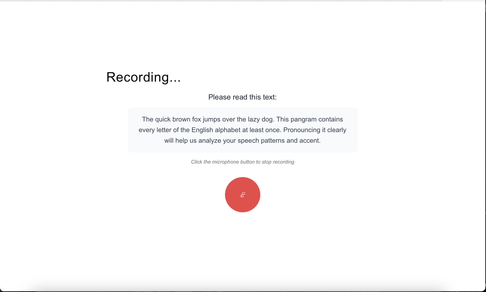
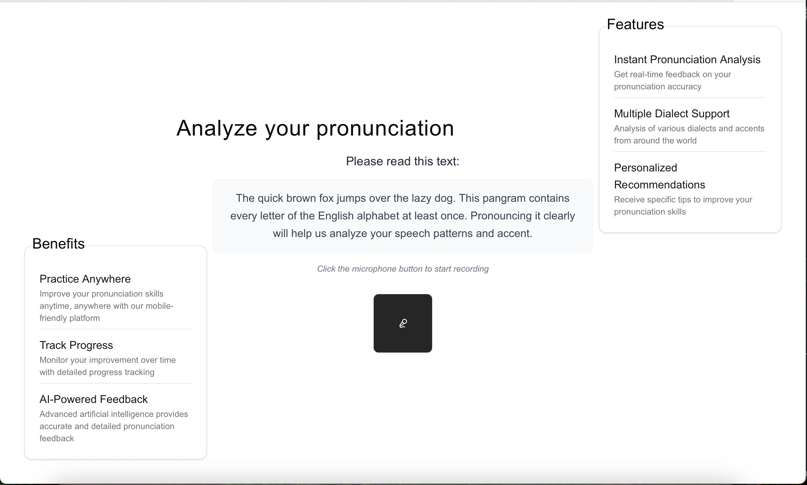
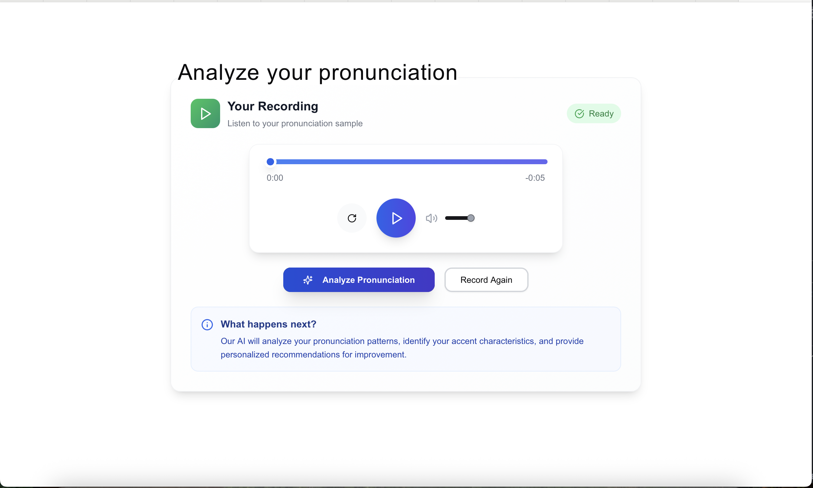

# AI English Pronunciation Analyzer

An AI-powered Next.js application that analyzes English pronunciation using OpenAI's Whisper and GPT-4 APIs. Record your speech, get transcription, and receive detailed pronunciation feedback.

## Screenshots

### Recording Interface

*Clean and intuitive recording interface with sample text for pronunciation practice*

### Audio Analysis

*Custom audio player with analysis controls and feedback options*

### AI Analysis Results

*Detailed pronunciation analysis with AI-powered feedback and recommendations*

## Features

- 🎤 **Voice Recording**: Browser-based audio recording with cross-browser compatibility
- 🔊 **Audio Playback**: Custom audio player with timeline and volume controls
- 📝 **Speech Transcription**: Powered by OpenAI Whisper API
- 🤖 **AI Analysis**: Detailed pronunciation feedback using GPT-4
- 📱 **Responsive Design**: Mobile-friendly interface with smooth animations
- 🎯 **Real-time Feedback**: Instant analysis of pronunciation accuracy

## Tech Stack

- **Frontend**: Next.js 15 with React 19, TypeScript, Tailwind CSS
- **UI Components**: Radix UI primitives with shadcn/ui styling
- **AI Integration**: OpenAI Whisper (speech recognition) + GPT-4 (pronunciation analysis)
- **State Management**: React hooks for local component state
- **Icons**: Lucide React

## Getting Started

### Prerequisites

- Node.js (v18 or later)
- OpenAI API key

### Installation

1. Clone the repository:
```bash
git clone <repository-url>
cd ai-prononciation-response
```

2. Install dependencies:
```bash
npm install
```

3. Create a `.env` file and add your OpenAI API key:
```env
OPENAI_API_KEY=your_openai_api_key_here
```

### Development

Run the development server:
```bash
npm run dev
```

Open [http://localhost:3000](http://localhost:3000) with your browser to see the application.

### Available Scripts

- `npm run dev` - Start development server with Turbopack
- `npm run build` - Build the application for production
- `npm run start` - Start production server
- `npm run lint` - Run ESLint for code quality checks

## How It Works

1. **Record Audio**: Click the record button to capture your speech using the browser's MediaRecorder API
2. **Audio Processing**: The recorded audio is validated and converted to the appropriate format
3. **Speech Transcription**: OpenAI Whisper API transcribes the audio to text
4. **AI Analysis**: GPT-4 analyzes the transcription and provides detailed pronunciation feedback
5. **Results Display**: View transcription and analysis in a user-friendly interface

## Audio Support

The application supports multiple audio formats with automatic format detection:
- WebM (preferred for Chrome/Edge)
- MP4/AAC (Safari)
- OGG (Firefox)
- WAV (fallback)

## Project Structure

```
├── app/
│   ├── page.tsx              # Main application page
│   └── layout.tsx            # Root layout
├── actions/
│   └── analyze-audio.ts      # Server actions for audio analysis
├── components/
│   ├── custom-audio-player.tsx    # Audio playback component
│   ├── custom-absolute-card.tsx   # Animated info cards
│   └── ui/                   # Reusable UI components
├── services/
│   ├── voice-service.ts      # OpenAI API integration
│   └── prompt.ts             # AI prompt management
└── hooks/
    └── use-audio-recorder.ts # Audio recording logic
```

## Configuration

The VoiceService supports flexible configuration:

```typescript
const voiceService = new VoiceService({
  apiKey: 'your-openai-key',     // Defaults to env variable
  whisperModel: 'whisper-1',     // Transcription model
  gptModel: 'gpt-4',             // Analysis model
  enableLogging: true,           // Enable/disable logging
  maxRetries: 3                  // API call retry attempts
});
```

## Deployment

The easiest way to deploy is using the [Vercel Platform](https://vercel.com/new?utm_medium=default-template&filter=next.js&utm_source=create-next-app&utm_campaign=create-next-app-readme):

1. Push your code to GitHub
2. Import your repository on Vercel
3. Add your `OPENAI_API_KEY` environment variable
4. Deploy!

For other deployment options, check out the [Next.js deployment documentation](https://nextjs.org/docs/app/building-your-application/deploying).

## Contributing

1. Fork the repository
2. Create your feature branch (`git checkout -b feature/amazing-feature`)
3. Commit your changes (`git commit -m 'Add some amazing feature'`)
4. Push to the branch (`git push origin feature/amazing-feature`)
5. Open a Pull Request

## License

This project is open source and available under the [MIT License](LICENSE).